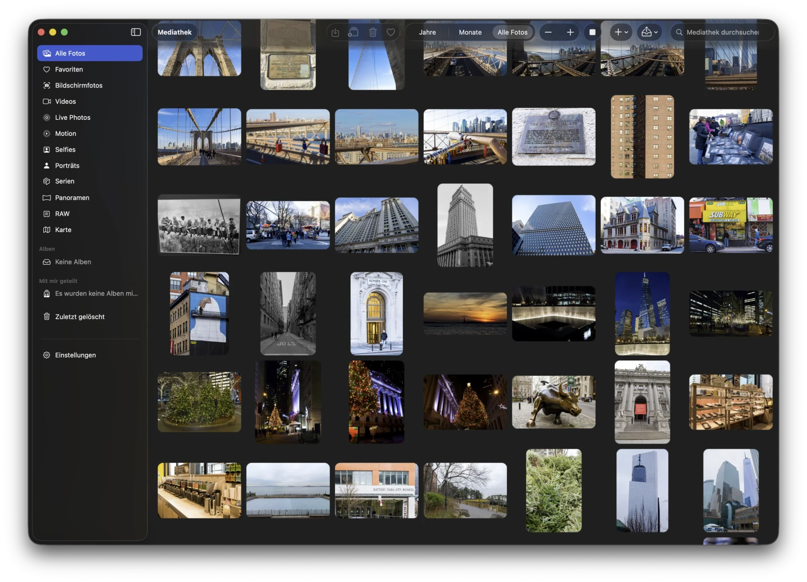
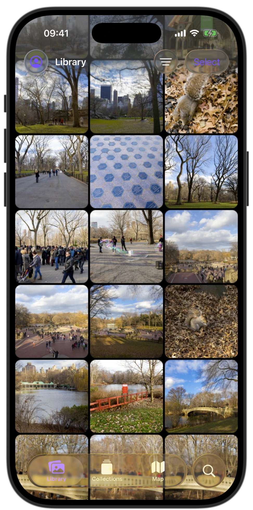

# Encrypted Memories

<p align="center">
  <strong>Private memories. One calm, native experience.</strong><br>
  A fast, end-to-end encrypted photo library for macOS, iPhone, and iPad.
</p>

<p align="center">
  
  
  
</p>

<p align="center">
  <a href="https://apps.apple.com/app/id6805117080">
    
  </a>
</p>

<p align="center">
  <a href="https://memories.oncloud.at/">Website</a>
  ·
  <a href="https://github.com/OnCloud-at/encrypted-memories/wiki/Quick-Start">Get started</a>
  ·
  <a href="https://github.com/OnCloud-at/encrypted-memories/wiki/Device-and-Feature-Support">See supported features</a>
  ·
  <a href="CONTRIBUTING.md">Contribute</a>
</p>

Encrypted Memories is an independent photo client for Proton Drive. It requires an existing Proton account and does not create accounts.

The app uses Proton Drive's end-to-end encrypted storage and browser-based session fork authentication. Shared feature modules implement library, backup, albums, search, map, cache, and viewer behavior once for macOS, iOS, and iPadOS. Platform targets provide native AppKit or UIKit presentation around those modules.

Encrypted Memories is not affiliated with or endorsed by Proton AG.

## Support Encrypted Memories

Encrypted Memories is free and open source. Every feature remains available without payment.

**[Sponsor Encrypted Memories through GitHub Sponsors](https://github.com/sponsors/traktuner)**

GitHub Sponsors supports one-time and monthly contributions. App Store releases also offer optional, repeatable tips. Sponsorship does not purchase features, priority support, or influence over the project.

Financial support helps cover Apple membership, test devices, infrastructure, and release work.

## Features

- End-to-end encrypted Proton Drive photo library.
- Metal timeline with responsive grid densities, selection, transitions, and viewport-aware loading.
- Full-screen image, video, Live Photo, and burst viewing.
- Albums, trash, restore, sharing, and original-format export.
- Photo Library backup on macOS, iOS, and iPadOS with persistent queues, streamed hashing, duplicate detection, crash recovery, album synchronization, and OS-scheduled background catch-up.
- MapKit browsing with encrypted location metadata and adaptive clustering.
- Encrypted thumbnail, preview, original, and offline caches.
- Optional on-device Smart Search using Core ML. Model artifacts and the local search index stay on the device, and photos and search queries are not sent to a search service. Initial indexing can temporarily make the device warmer. Its duration varies with the number of photos and the device's performance, so large libraries can take longer to finish.
- Shared network request governance for foreground interactions and background work.

## Platform Status

macOS, iOS, and iPadOS use the same shared feature cores and provide the same primary library, viewer, album, backup, map, and Smart Search capabilities. Library loading, connectivity, and background-work status use shared presentation policy, while navigation, controls, gestures, and system integrations remain platform native.

`Vendor/sdk-swift` is used as a local path dependency for the Proton Drive SDK.

## User Documentation

The [Encrypted Memories Wiki](https://github.com/OnCloud-at/encrypted-memories/wiki) contains the Quick Start, one guide for each app area, troubleshooting, and the current device and feature support matrix.

GitHub Issues is the official support channel for questions, reproducible bugs, and concrete feature proposals. Check the Wiki and existing issues before opening a support request.

The reviewed Wiki source lives in [`Wiki`](Wiki). GitHub stores the visible Wiki in the separate Git endpoint attached to this repository. Maintainers can preview a Wiki sync or publish it with:

```bash
./scripts/publish-wiki.sh
./scripts/publish-wiki.sh --publish
```

## Technology

- Swift, SwiftUI, AppKit, UIKit, MapKit, AVFoundation, Core ML, CryptoKit, and SQLite.
- Metal-based timeline rendering with shared layout, transition, composition, and residency policies.
- Swift Package Manager modules under `Packages/EncryptedMemoriesKit`.
- Xcode project generation from `project.yml` with XcodeGen.
- The official open-source Proton Drive SDK 0.25.0, distributed under the MIT License and restored at `Vendor/sdk-swift`.

`EncryptedMemoriesKit` is application-internal source. Its public declarations support package target
boundaries and are not a stable third-party library API.

## Security

- Sign-in uses Proton's web flow. The app does not collect the user's Proton password.
- Session credentials are stored in the platform Keychain with device-only accessibility.
- The SDK's unified cache is account-scoped and encrypted with a dedicated 32-byte derived key.
  Legacy plaintext SDK databases are removed during launch.
- Local thumbnails, previews, originals, account metadata, location data, and ML vectors are encrypted at rest.
- Video playback stores Proton-encrypted blocks on disk and decrypts requested ranges in memory.
- Decrypted originals are written only when the user exports or shares them.
- Release builds do not write file debug logs. Runtime-gated unified logging is disabled unless explicitly enabled for a local investigation.
- The macOS app uses App Sandbox, outgoing network access, and user-selected file access. Hardened Runtime remains enabled without JIT or unsigned executable memory.

## Requirements

- macOS 26, iOS 26, or iPadOS 26 on a Metal 3 device. See the [device support matrix](https://github.com/OnCloud-at/encrypted-memories/wiki/Device-and-Feature-Support).
- Xcode 26 or newer installed at `/Applications/Xcode.app`.
- XcodeGen available on `PATH`.
- An Apple development team is required only for signed device installation.
- Git access to the Proton Drive SDK repository if `Vendor/sdk-swift` is not present.

Select the full Xcode toolchain:

```bash
export DEVELOPER_DIR=/Applications/Xcode.app/Contents/Developer
```

## Bootstrap

```bash
git clone https://github.com/OnCloud-at/encrypted-memories.git
cd encrypted-memories
./scripts/update-proton-sdk.sh 0.25.0
./scripts/proton-sdk-current-version.sh
xcodegen generate
```

The SDK checkout is reproducible: the bootstrap script applies the versioned fixes tracked under
`VendorPatches/sdk-swift/0.25.0` after checking out the upstream tag. The updater fails before
changing the checkout when the requested tag has no reviewed patch set.
The repository retains a complete patch set only for the currently supported SDK tag. An SDK upgrade
must add its reviewed patch and `UPSTREAM_COMMIT` pin together.

## Build

Build macOS without installing the app:

```bash
export DEVELOPER_DIR=/Applications/Xcode.app/Contents/Developer
export ENCRYPTED_MEMORIES_BUILD_ROOT="$HOME/Developer/xcode/EncryptedMemories"
xcodebuild build \
  -project EncryptedMemories.xcodeproj \
  -scheme EncryptedMemories \
  -destination 'generic/platform=macOS' \
  -derivedDataPath "$ENCRYPTED_MEMORIES_BUILD_ROOT/DD.noindex" \
  -clonedSourcePackagesDirPath "$ENCRYPTED_MEMORIES_BUILD_ROOT/SourcePackages.noindex" \
  -packageCachePath "$ENCRYPTED_MEMORIES_BUILD_ROOT/XcodePackageCache.noindex" \
  -onlyUsePackageVersionsFromResolvedFile \
  -skipPackagePluginValidation \
  -skipMacroValidation \
  CODE_SIGNING_ALLOWED=NO
```

Build the iOS/iPadOS target without signing:

```bash
export DEVELOPER_DIR=/Applications/Xcode.app/Contents/Developer
export ENCRYPTED_MEMORIES_BUILD_ROOT="$HOME/Developer/xcode/EncryptedMemories"
xcodebuild build \
  -project EncryptedMemories.xcodeproj \
  -scheme EncryptedMemoriesMobile \
  -destination 'generic/platform=iOS' \
  -derivedDataPath "$ENCRYPTED_MEMORIES_BUILD_ROOT/DD.ios.noindex" \
  -clonedSourcePackagesDirPath "$ENCRYPTED_MEMORIES_BUILD_ROOT/SourcePackages.noindex" \
  -packageCachePath "$ENCRYPTED_MEMORIES_BUILD_ROOT/XcodePackageCache.noindex" \
  -onlyUsePackageVersionsFromResolvedFile \
  -skipPackagePluginValidation \
  -skipMacroValidation \
  CODE_SIGNING_ALLOWED=NO
```

For local development, the rebuild script generates the project, builds and launches the signed macOS app, and installs the iOS app when a configured device is connected. Set `ENCRYPTED_MEMORIES_IOS_DEVICE_NAME` to select a specific device. The macOS app is accepted only when its signature, TeamIdentifier, and signed entitlement blob validate before and after installation:

```bash
./scripts/rebuild.sh
```

The rebuild script does not run tests.

All scripts share package downloads below `ENCRYPTED_MEMORIES_BUILD_ROOT`; do not create per-worktree
DerivedData or SwiftPM scratch directories. Use `./scripts/report-build-storage.sh` to inspect the
canonical root and detect ad-hoc Proton build trees under `/private/tmp`.

## Apple Releases

Reviewed GitHub Actions workflows own Apple distribution.
PR authors never set app versions, build numbers, release tags, or release notes.
A maintainer publishes a GitHub Release after its tagged commit passes the pull request checks.

- A prerelease tag such as `v1.2.0-beta.1` or `v1.2.0-rc.1` builds iOS and macOS. It publishes both builds only to internal TestFlight.
- A stable tag such as `v1.2.0` builds both apps. It creates the platform versions when necessary, updates both localizations, submits each platform to App Review, and selects automatic release after approval.
- A manual workflow run can retry an existing published release tag. It reuses the GitHub Release ID as the Apple build number and does not create duplicate builds.
- GitHub prereleases do not replace the latest stable GitHub Release.
- The workflow never attaches a signed macOS app to the GitHub Release. The supported macOS distribution channel is the Mac App Store.

### Release notes

Write owner-written Apple release notes under `## English`. This is the only required section. This section alone is valid:

```markdown
## English
Short user-facing changes in English.
```

A platform-specific release body looks like this:

```markdown
## English
### All Platforms
Shared user-facing changes.

### iOS and iPadOS
Mobile-specific changes.

### macOS
Mac-specific changes.
```

The optional platform subsections are `### All Platforms`, `### iOS and iPadOS`, and `### macOS`.
Without platform subsections, English applies to both platforms. With platform subsections, each platform receives the shared `All Platforms` text plus its specific text.

`## Deutsch` is optional and uses the same structure. When German is absent, English is used for `de-DE`.

Other GitHub sections are allowed. Automation sends only extracted owner text from the Apple sections to Apple.
Contributor names, pull request lists, and generated changelog text never reach Apple.

Before stable replacement, automation waits for both new platform builds.
It validates both platform plans before it changes either review submission.
It removes lower active review versions independently per platform.
It removes a version only when Apple reports an Apple-removable state.
It waits for `DEVELOPER_REJECTED` after each removal.
It then changes the same App Store version record to the release version and starts a new review submission.
If Apple rejects that update, the workflow stops without deleting that record or creating a fallback for that platform.
A rerun continues from Apple's authoritative state.
It refuses equal or newer active versions and unsafe states.

### External TestFlight

The manual `External TestFlight` workflow runs from `main` with one published release tag.
It reuses the release's existing iOS and macOS builds. It never rebuilds or uploads them.
Stable and prerelease release tags can be promoted externally.

Owner action: `Actions` → `External TestFlight` → `Run workflow` from `main` → enter the published release tag.
GitHub then pauses at the configured `testflight-external` approval gate. Approve that deployment to continue.

The workflow uses the `testflight-external` environment.
The optional repository variable `TESTFLIGHT_EXTERNAL_GROUP_NAME` overrides the default `External Testers` group.

Configure these repository variables:

- `APP_STORE_CONNECT_APP_ID`
- `APPLE_DEVELOPER_TEAM_ID`

Configure the App Store Connect issuer, key ID, and Base64-encoded private key as environment secrets. The `testflight-internal` environment also needs one Base64-encoded PKCS#12 archive and its password. The archive must contain the Apple Distribution and Mac Installer Distribution identities.

Use custom deployment branch and tag policies on every Apple environment. These server-side policies are the security boundary for environment secrets.

- `testflight-internal`: allow the `main` branch and `v*` tags.
- `testflight-external`: allow only the `main` branch.
- `app-store-production`: allow the `main` branch and `v*` tags.

Do not loosen these policies. Do not require a production approval when stable GitHub Releases must enter review without another click.

The workflow validates the configured in-app purchases before it starts a macOS runner. The sandbox preflight checks the App Store Connect bundle ID, its `IN_APP_PURCHASE` capability, exact product IDs, product type, current metadata version, active prices, availability in Austria and the United States, and metadata against `.github/app-store-connect/in-app-purchases.json`. Apple does not expose Paid Apps Agreement, banking, or tax status through this API. Those three items must be `Active` in App Store Connect.

The stable path adds the review-only checks for review notes and processed screenshots. It refuses automatic review submission until App Store Connect reports every tip as approved. For the first tip submission, add the iOS version and all four tips to one iOS submission in App Store Connect. Submit the macOS version separately. Apple does not support the first in-app purchase submission through the review-submission API.

External TestFlight and App Review also require a working reviewer account because the photo library is available only
after Proton sign-in. Store the reviewer username, password, contact information, and review notes only in App Store
Connect. The App Store submission workflow confirms that these fields exist without printing their values. Keep the
account active, give it enough sample data to exercise the submitted features, and document any verification steps in
the review notes.

Debug, TestFlight, and App Store builds all load products from App Store Connect. The repository does not contain
a local StoreKit product catalog. TestFlight runs purchases in Apple's sandbox automatically, so use the processed
TestFlight build to verify the same product data and purchase sheet that App Review receives.

Keep the iPhone and iPad app unavailable on Apple Silicon Mac in App Store Connect. The native macOS archive
uses the `EncryptedMemories` scheme. The TestFlight workflows also disable mobile builds on Mac for their groups.

## Tests

Run the complete Swift package suite:

```bash
./scripts/verify-tests.sh
```

This runs both `EncryptedMemoriesKit` and the vendored SDK's own tests. A dependency's test targets are
not executed when it is consumed as a local SwiftPM package.

Run the iOS app-shell tests on a simulator:

```bash
./scripts/verify-ios-app-tests.sh
```

Override `IOS_TEST_DESTINATION` when the default iPhone simulator is not installed.

Run the fast shared-core and platform-boundary gate:

```bash
./scripts/verify-universal-core.sh fast
```

Run the complete shared-core verification or the iOS shell build:

```bash
./scripts/verify-universal-core.sh
./scripts/verify-ios-app-shell.sh
```

The test targets cover module and import boundaries, encrypted persistence, media caching and decoding, backup deduplication and recovery, grid layout and rendering, viewer and map behavior, Smart Search model and index lifecycle, localization, and production route guards.

## Repository Layout

- `App` contains the macOS app and AppKit/SwiftUI composition.
- `iOSApp` contains the iOS/iPadOS app and UIKit/SwiftUI composition.
- `Packages/EncryptedMemoriesKit` contains shared core, feature, renderer, cache, backend, and platform-adapter modules.
- `Branding` contains app icons and product assets.
- `Tools` contains development utilities.
- `Vendor/sdk-swift` contains the local Proton Drive SDK checkout.
- `project.yml` is the source of truth for generated Xcode project settings.
- `scripts` contains local build, verification, and SDK helpers.
- `.github` contains the reviewed build and release automation.

## License

Encrypted Memories is available under the permissive [MIT License](LICENSE). You may use, copy, modify, distribute, sublicense, and sell the original project source under its terms.

The software is provided without warranty or a support obligation. Dependencies and optional model artifacts retain their respective license terms.

Apple and the Apple logo are trademarks of Apple Inc., registered in the U.S. and other countries and regions. App Store is a service mark of Apple Inc.
